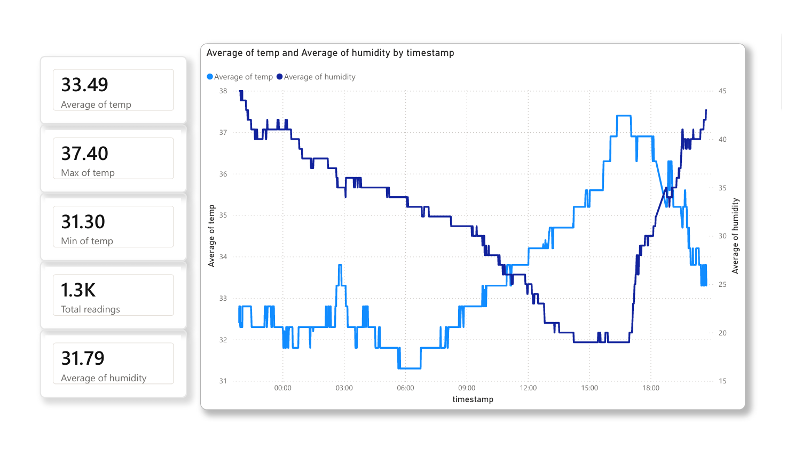
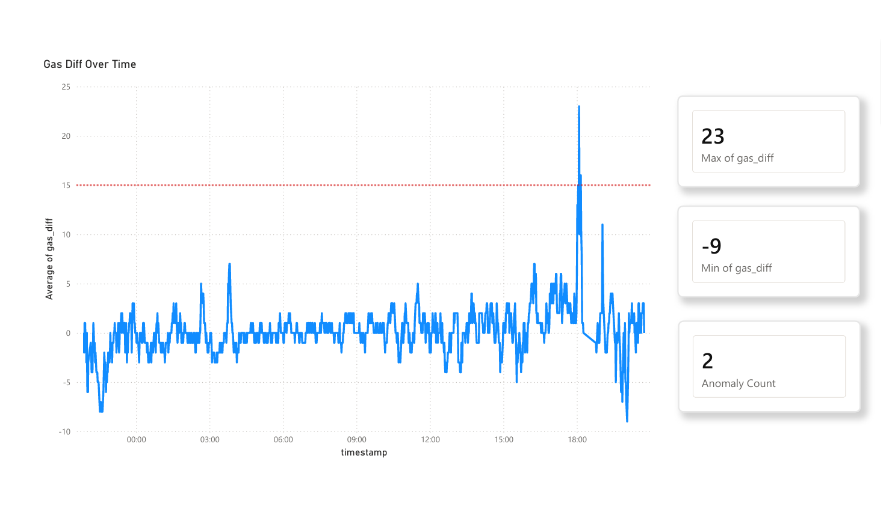
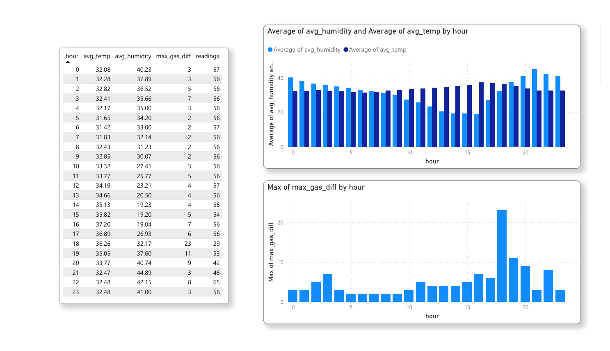
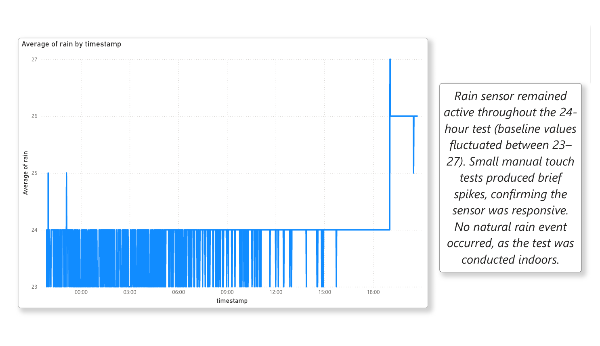

# room-monitoring-analysis

A 24-hour environmental monitoring system built with Arduino, Python, and Power BI — tracking temperature, humidity, gas levels, and moisture in a single room.

## Why this project

Environmental monitoring is a common need — a tenant tracking humidity for a landlord dispute, someone checking air quality in a small office, or just curiosity about how a room's conditions change over a day. This project explores what a lightweight, low-cost sensor setup can (and can't) reliably tell you.

The gas sensor used here (MQ-series) doesn't provide calibrated ppm readings — it's a hobbyist-grade component. Rather than treating its raw output as an absolute measurement, this project uses a **rolling baseline** approach: tracking deviation from the sensor's own recent average to flag anomalies (like a burst of fumes) instead of chasing precision the hardware can't deliver. That trade-off — accepting lower absolute accuracy in exchange for a more honest and practical signal — shaped most of the design decisions below.

## What it does

- **Arduino (UNO)** reads four sensors every few seconds and displays live readings on an LCD:
  - DHT11 — temperature & humidity
  - MQ gas sensor — air quality (baseline-relative anomaly detection)
  - Rain/moisture sensor — wetness detection
- **Python** logs one reading per minute to CSV over serial, running continuously for 24 hours
- **Power BI** dashboard visualizes the full day across four pages: Overview, Gas Analysis, Hourly Summary, and Rain Sensor

## Tech stack

`Arduino (C++)` · `Python (pandas, matplotlib, pyserial)` · `Power BI`

## How it works
Sensors → Arduino → Serial (USB) → Python (log_sensor.py) → CSV → Python (analyze.py) → Power BI

1. `room_data.ino` — reads sensors, runs a 3-screen LCD rotation, and prints one log line per minute over serial
2. `log_sensor.py` — listens on the serial port and appends each reading to `sensor_log.csv`
3. `analyze.py` — loads the CSV with pandas, generates summary statistics, detects gas anomalies, builds an hourly summary, and plots a matplotlib chart
4. `room_monitoring_dashboard.pbix` — imports both `sensor_log.csv` and `hourly_summary.csv` for interactive dashboards

## Findings

- **Clear daily cycle:** temperature peaked around 37°C in the late afternoon, humidity moved inversely (dropping as low as 19% at the same time)
- **Gas anomaly detection worked:** 2 events crossed the alert threshold over 24 hours, both traceable to deliberate triggers (breath, perfume) rather than sensor noise
- **Rain sensor confirmed active but untriggered:** values stayed stable (23–27) with brief spikes from manual touch tests — no natural rain occurred indoors, as expected

## Limitations

- The gas sensor requires a long warm-up period and drifts over time; a fixed calibration point wasn't reliable, so a slowly-adapting baseline was used instead
- Single-room, single-day test — no comparison across conditions or longer-term trends
- Rain sensor's actual "wet" trigger behavior was only confirmed via manual touch, not real rainfall

## Dashboard preview

## Files

- `room_data.ino` — Arduino sketch
- `log_sensor.py` — serial-to-CSV logger
- `analyze.py` — data analysis and plotting
- `sensor_log.csv` — raw 24-hour log (1-minute intervals)
- `hourly_summary.csv` — hourly aggregated stats
- `sensor_analysis.png` — matplotlib output
- `room_monitoring_dashboard.pbix` — full interactive Power BI dashboard